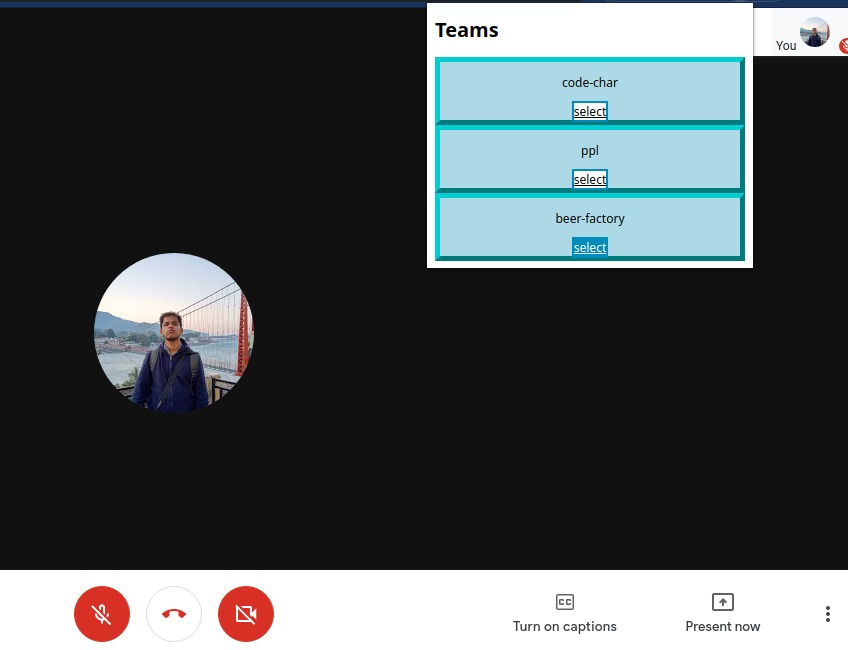
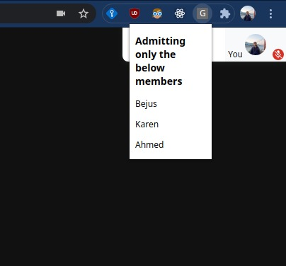

# Gmeet extension

### Setup

1. Clone the repo
2. Open ```chrome://extensions/```
3. Enable developer mode
4. Click on load unpacked and select project folder

### Features
- Auto Admit the members of a selected to the particular google meet.

- Display the team members name

